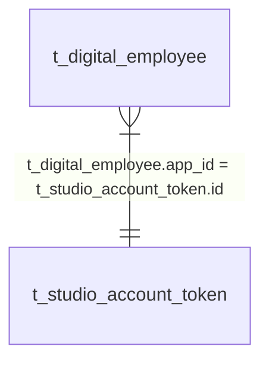

# DIP Studio 数据库设计

## t_studio_config

- rds: MariaDB
- db: kweaver
- table: t_studio_config
- description: DIP Studio 平台配置
- schema:

| 字段 | 数据类型 | 允许为空 | 索引 | 备注 |
| -- | -- | -- | -- | -- |
| id | INT | NOT NULL | PK | 自增主键 |
| kweaver_base_url | VARCHAR(255) |  |  | KWeaver 服务连接地址 |
| openclaw_address | VARCHAR(255) |  |  | OpenClaw 网关连接地址 |
| openclaw_token | VARCHAR(255) |  |  | OpenClaw 网关 Token |

## t_digital_employee

- rds: MariaDB
- db: kweaver
- table: t_digital_employee
- description: 数字员工信息表
- schema:

| 字段 | 数据类型 | 允许为空 | 索引 | 备注 |
| -- | -- | -- | -- | -- |
| id | CHAR(36) | NOT NULL | PK | 数字员工 ID，等同于 agentId |
| app_id | CHAR(36) |  | Y | 数字员工绑定的应用账号 app_id |
| bkn_scope | VARCHAR(4096) |  |  | 数字员工的知识范围，逗号隔开的 id 列表 |
| is_deleted | BOOLEAN |  |  | 标记数字员工是否被删除 |

## t_studio_user_preference

- rds: MariaDB（达梦 DM8 见 `studio/migrations/dm8/`，`pinned_digital_human_ids` 为 TEXT 存 JSON 数组文本，`user_id` 长度 255 以兼容 OAuth subject）
- db: kweaver
- table: t_studio_user_preference
- description: Studio 用户偏好表；当前用于**侧栏钉选（固定）数字员工**，每个登录用户最多一行。
- schema:

| 字段 | 数据类型 | 允许为空 | 索引 | 备注 |
| -- | -- | -- | -- | -- |
| user_id | VARCHAR(255) | NOT NULL | PK | 用户 ID（与登录主体一致，OAuth subject 等可能长于 36） |
| pinned_digital_human_ids | JSON | NOT NULL |  | 侧栏钉选数字员工 ID 的有序列表，JSON 数组，元素为 `agentId`（与 `t_digital_employee.id` 同源）；默认 `[]`。写入前服务端会去重、修剪不可解析或已删除员工 id；**业务上限 8 条**，由 HTTP API 校验（表级不强制） |
| updated_at | TIMESTAMP | NOT NULL |  | 更新时间，`ON UPDATE CURRENT_TIMESTAMP` |

## t_studio_account_token

- rds: MariaDB
- db: kweaver
- table: t_studio_account_token
- description: 按主体（用户或应用）存储的 KWeaver/BKN 访问令牌
- schema:

| 字段 | 数据类型 | 允许为空 | 索引 | 备注 |
| -- | -- | -- | -- | -- |
| f_id | VARCHAR(255) | NOT NULL | PK | 主键；`f_type=user` 时为平台 `userId`；`f_type=app` 时为 `appId`（全表唯一） |
| f_type | VARCHAR(16) | NOT NULL |  | `app`：应用账号；`user`：用户代理 PAT |
| f_token | TEXT | NOT NULL |  | 访问 BKN 的令牌串 |

## ER 关系

