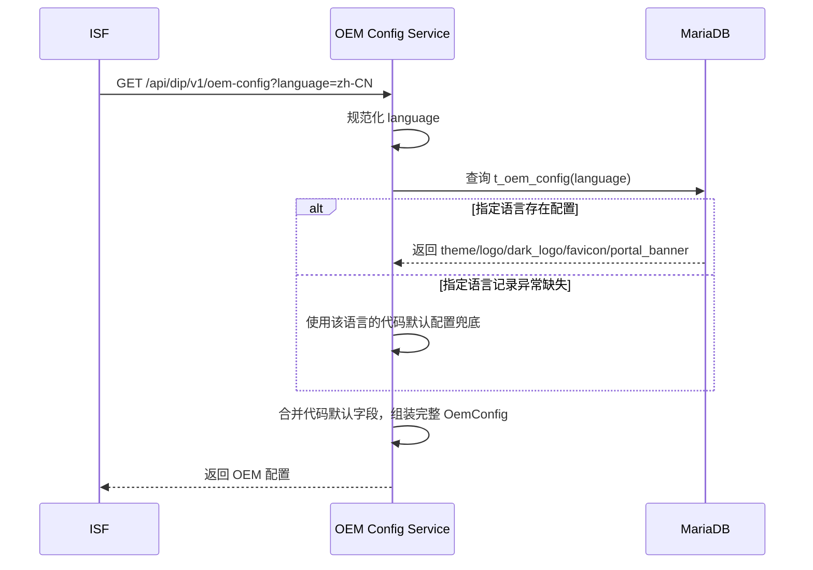
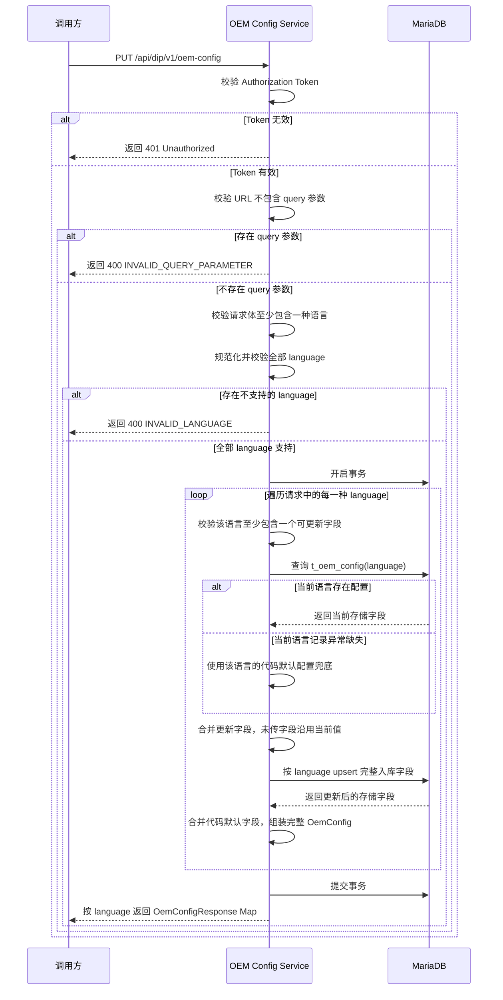

# OEM Config

## 背景

`oem-config` 用于向 ISF 提供 DIP 产品级品牌化配置，包括主题色、Logo、深色 Logo、站点图标和门户 Banner。ISF 在渲染登录页、门户页或品牌相关入口时，通过 OEM 配置接口读取当前配置。

本需求作为 DIP OEM 配置的首版实现，提供 `GET /api/dip/v1/oem-config` 查询接口和 `PUT /api/dip/v1/oem-config` 修改接口。服务启动时会为支持的语言初始化默认配置，GET 按 `language` 查询对应配置，PUT 用于持有效 token 的调用方更新当前 OEM 配置。

## 术语说明

| 术语 | 解释 |
| --- | --- |
| DIP | Decision Intelligence Platform，决策智能体平台产品整体。 |
| OEM | Original Equipment Manufacturer。本文档中特指产品品牌定制配置，包括主题色、Logo、深色 Logo、Favicon、门户 Banner 等资源。 |
| ISF | Information Security Fabric，统一登录页能力。ISF 会根据登录流程传入的 `oem_config_url` 读取 OEM 配置，用于渲染登录页品牌资源。 |

## 目标

1. 实现 `GET /oem-config` 查询能力，作为公开接口供 ISF 读取。
2. 实现 `PUT /oem-config` 修改能力，用于更新当前 OEM 配置。
3. 数据库只持久化需要动态配置的字段：`theme`、`logo`、`dark_logo`、`favicon`、`portal_banner`。
4. 其余字段由后端代码提供默认值或派生处理，避免把固定展示策略全部写入数据库。
5. OEM 是 DIP 产品级能力，接口对外地址使用 `/api/dip/v1/oem-config`，不挂在 `/api/dip-hub/v1` 下。

## 实现范围

相关代码：

- `src/routers/oem_config_router.py`：注册 `GET /oem-config` 和 `PUT /oem-config` 路由，将领域模型转换为接口响应。
- `src/application/oem_config_service.py`：规范化并校验语言参数，数据库记录异常缺失时使用该语言的代码默认配置兜底。
- `src/ports/oem_config_port.py`：定义 OEM 配置读取和修改端口。
- `src/adapters/oem_config_adapter.py`：从 MariaDB 表 `t_oem_config` 读取和写入配置。
- `src/infrastructure/database/oem_config_schema.py`：定义 `t_oem_config` 表结构。
- `src/domains/oem_config.py`：定义 `OemConfig`、`OemConfigQuery` 和 `DEFAULT_OEM_CONFIG`。

数据库表只保存需要动态配置的字段。`product`、`login_box_style`、`hide_logo`、`show_portal_banner`、`show_user_agreement`、`show_privacy_policy`、`web_template`、`desktop_template` 等固定策略字段不入库，由代码默认值生成。

## 接口设计

### GET /oem-config

用途：供 ISF 读取 OEM 配置。

对外地址：`GET /api/dip/v1/oem-config`

鉴权：公开接口，不需要鉴权。

GET 时序图：



Query：

| 字段 | 类型 | 必填 | 说明 |
| --- | --- | --- | --- |
| language | string | 是 | 语言标识，仅支持 `zh-CN`、`en`、`zh-TW` |

响应字段：

| 字段 | 来源 | 说明 |
| --- | --- | --- |
| product | 代码默认值 | 产品名称 |
| theme | 数据库 | 主题色 |
| loginBoxStyle | 代码默认值 | 登录框样式 |
| hideLogo | 代码默认值 | 是否隐藏 Logo |
| showPortalBanner | 代码默认值 | 是否展示门户 Banner |
| showUserAgreement | 代码默认值 | 是否展示用户协议 |
| showPrivacyPolicy | 代码默认值 | 是否展示隐私政策 |
| webTemplate | 代码默认值 | Web 模板名称 |
| desktopTemplate | 代码默认值 | 桌面端模板名称 |
| logo | 数据库 | 浅色 Logo Base64 字符串 |
| darkLogo | 数据库 | 深色 Logo Base64 字符串 |
| portalBanner | 数据库 | 门户 Banner 文案或资源 |
| favicon | 数据库 | 站点图标 Base64 字符串 |

### PUT /oem-config

用途：更新 OEM 配置。

对外地址：`PUT /api/dip/v1/oem-config`

鉴权：需要有效 Authorization Token，不加入公开白名单。

PUT 时序图：



请求体：

```json
{
  "zh-CN": {
    "portalBanner": "决策智能体平台"
  },
  "en": {
    "portalBanner": "Decision Agent Platform"
  },
  "zh-TW": {
    "portalBanner": "決策智能體平台"
  }
}
```

字段说明：

| 字段 | 类型 | 必填 | 说明 |
| --- | --- | --- | --- |
| zh-CN | object | 否 | 中文配置，至少需要传入一个可更新字段 |
| en | object | 否 | 英文配置，至少需要传入一个可更新字段 |
| zh-TW | object | 否 | 繁体中文配置，至少需要传入一个可更新字段 |

每种语言对象支持的字段：

| 字段 | 类型 | 必填 | 入库字段 | 说明 |
| --- | --- | --- | --- | --- |
| theme | string | 否 | theme | 主题色，仅支持 `#RGB` 或 `#RRGGBB` 十六进制颜色值 |
| logo | string | 否 | logo | 浅色 Logo Base64 字符串，不要带 `data:image/png;base64,` 前缀 |
| darkLogo | string | 否 | dark_logo | 深色 Logo Base64 字符串，不要带 `data:image/png;base64,` 前缀 |
| favicon | string | 否 | favicon | 站点图标 Base64 字符串，不要带 `data:image/png;base64,` 前缀 |
| portalBanner | string | 否 | portal_banner | 门户 Banner 文案或资源 |

PUT 接口不支持任何 query 参数。语言标识只允许放在请求体顶层 key 中；如果 URL 携带 `?language=...` 或其他 query 参数，接口返回 `INVALID_QUERY_PARAMETER`。

请求体必须至少包含 `zh-CN`、`en`、`zh-TW` 中的一种语言。传入哪种语言就只修改哪种语言；同一种语言下只更新请求中传入的字段，未传字段保持原状。传入字符串字段时，接口会先去掉首尾空格；去掉后为空、主题色格式非法、图片字段不是合法 Base64、语言标识不支持时，接口返回校验错误，且不会写入任何语言配置。

每种语言对象只允许传入 `theme`、`logo`、`darkLogo`、`favicon`、`portalBanner`，传入 `portalBanner1` 等未定义字段时接口返回校验错误。

接口层会对语言标识做有限规范化兼容，例如 `zh-cn -> zh-CN`、`zh-tw -> zh-TW`、`EN -> en`；归一化后若不在支持集合内，则直接返回校验错误。

多语言写入必须在同一个数据库事务内完成。接口失败时应整体回滚，不能出现某一种语言已经入库、其他语言失败的半成功状态。

处理逻辑：

1. Router 使用 `OemConfigBatchUpdateRequest` 接收请求体。
2. Router 校验 URL 不包含 query 参数。
3. Router 校验请求体至少包含一种语言，且每种语言对象至少包含一个可更新字段。
4. Service 先规范化并校验全部语言标识，仅允许 `zh-CN`、`en`、`zh-TW`。
5. 如果存在空语言或不支持的语言，直接返回校验错误，不执行数据库写入。
6. Service 按语言读取当前有效配置，未传字段沿用当前值，只覆盖请求中传入的字段。
7. Adapter 在同一个数据库事务内使用 `language` 做批量 upsert，落库时仍保存完整入库字段。
8. 更新完成后按 `language` 返回完整 `OemConfigResponse` Map。

## 数据库设计

首版表结构只包含查询定位字段、需要动态配置的字段和审计字段：

```sql
CREATE TABLE IF NOT EXISTS `t_oem_config` (
    `id` BIGINT NOT NULL AUTO_INCREMENT COMMENT '主键ID',
    `language` VARCHAR(32) NOT NULL COMMENT '语言标识',
    `theme` VARCHAR(32) NOT NULL COMMENT '主题色',
    `logo` LONGTEXT NOT NULL COMMENT '浅色 Logo Base64 字符串',
    `dark_logo` LONGTEXT NOT NULL COMMENT '深色 Logo Base64 字符串',
    `portal_banner` LONGTEXT NOT NULL COMMENT '门户 Banner 文案或资源',
    `favicon` LONGTEXT NOT NULL COMMENT '站点图标 Base64 字符串',
    `created_at` TIMESTAMP NOT NULL DEFAULT CURRENT_TIMESTAMP COMMENT '创建时间',
    `updated_at` TIMESTAMP NOT NULL DEFAULT CURRENT_TIMESTAMP ON UPDATE CURRENT_TIMESTAMP COMMENT '更新时间',
    PRIMARY KEY (`id`),
    UNIQUE INDEX `idx_language` (`language`)
) ENGINE=InnoDB DEFAULT CHARSET=utf8mb4 COMMENT='OEM 配置表';
```

以下响应字段不入库：

- `product`
- `login_box_style`
- `hide_logo`
- `show_portal_banner`
- `show_user_agreement`
- `show_privacy_policy`
- `web_template`
- `desktop_template`

这些字段由 `DEFAULT_OEM_CONFIG` 或代码中的默认策略生成。

### `language` 唯一性

当前只存在一套 DIP OEM 配置，不需要额外的配置空间标识。因此数据库直接使用 `language` 唯一定位一条配置，更新时也直接按 `language` 做 upsert。

`language` 取值范围固定为 `zh-CN`、`en`、`zh-TW`。如果后续确实出现多套配置需求，再引入新的配置维度和迁移方案。

## 默认资源初始化

特定 `language` 的资源会在服务启动时初始化到数据库。

初始化入口：

- `src/infrastructure/database/init.py::_ensure_default_oem_config`

初始化语言：

- `zh-CN`
- `en`
- `zh-TW`

默认资源来源：

- `src/assets/oem/zh-CN/logo.png`
- `src/assets/oem/zh-CN/dark_logo.png`
- `src/assets/oem/zh-CN/favicon.png`
- `src/assets/oem/en/logo.png`
- `src/assets/oem/en/dark_logo.png`
- `src/assets/oem/en/favicon.png`
- `src/assets/oem/zh-TW/logo.png`
- `src/assets/oem/zh-TW/dark_logo.png`
- `src/assets/oem/zh-TW/favicon.png`
- `src/domains/oem_config.py::DEFAULT_OEM_CONFIG`

当前默认 Logo、Dark Logo、Favicon 图片资源以 PNG 静态资源文件保存，并按语言目录组织。代码启动时按 `language` 读取对应目录下的图片并转换为 Base64 字符串，再用于初始化数据库和默认响应。启动初始化使用 `INSERT ... ON DUPLICATE KEY UPDATE language = language`，即只补齐缺失记录，不覆盖数据库中已有的客户化配置。上述字段均会入库，并可通过 PUT 接口对应字段修改。

## 实现设计

### Domain

定义用于持久化的模型，避免数据库适配层依赖完整响应模型：

- `OemConfigStoredFields`
- `OemConfigUpdate`

`OemConfig` 表示对外完整响应。Service 从数据库读取存储字段后，与默认配置合并生成 `OemConfig`。

### Port

`OemConfigPort` 定义读取和修改契约：

```python
async def update_oem_configs(self, configs: list[OemConfigUpdate]) -> list[OemConfigStoredFields]:
    pass
```

### Adapter

读取 SQL 只查询入库字段：

```sql
SELECT language, theme, logo, dark_logo, portal_banner, favicon
FROM t_oem_config
WHERE language = %s
```

更新 SQL 使用 upsert：

```sql
INSERT INTO t_oem_config
    (language, theme, logo, dark_logo, portal_banner, favicon)
VALUES
    (%s, %s, %s, %s, %s, %s)
ON DUPLICATE KEY UPDATE
    theme = VALUES(theme),
    logo = VALUES(logo),
    dark_logo = VALUES(dark_logo),
    portal_banner = VALUES(portal_banner),
    favicon = VALUES(favicon);
```

批量更新时，Adapter 必须在同一个数据库事务内执行所有语言的 upsert。任一语言写入失败时回滚事务，不允许单个语言资源入库。

### Service

读取流程：

1. 规范化 `language`。
2. 读取对应语言存储字段。
3. 正常情况下支持语言已在启动时初始化到数据库；若记录异常缺失，则使用该语言的代码默认入库字段兜底。
4. 将存储字段覆盖到 `DEFAULT_OEM_CONFIG` 上，返回完整配置。

更新流程：

1. 校验请求体至少包含一种语言，且每种语言对象至少包含一个可更新字段。
2. 先规范化并校验全部语言标识，仅允许 `zh-CN`、`en`、`zh-TW`。
3. 如果存在空语言或不支持的语言，直接返回校验错误，不执行数据库写入。
4. 逐个读取请求中出现语言的当前有效配置。
5. 未传字段沿用当前值，只覆盖请求中传入的字段。
6. 调用端口按 `language` 在同一个事务内批量 upsert 完整入库字段。
7. 将更新后的存储字段合并到默认配置，按 `language` 返回完整配置。

### Router

定义：

```python
@router.put(
    OEM_CONFIG_PATH,
    summary="修改 OEM 配置",
    response_model=dict[str, OemConfigResponse],
)
async def update_oem_config(
    request: OemConfigBatchUpdateRequest,
) -> dict[str, OemConfigResponse]:
    ...
```

`OemConfigBatchUpdateRequest` 使用请求体顶层 key 表示语言，语言对象使用接口字段命名，即 `darkLogo`、`portalBanner`；进入 Service 前转换为领域模型字段 `dark_logo`、`portal_banner`。

### OpenAPI

`hub/openapi/public/hub/hub.paths.yaml` 定义 `put` 接口。

`hub/openapi/public/hub/hub.schemas.yaml` 定义 `OemConfigBatchUpdateRequest` 和 `OemConfig` 响应结构。

## 约束

- GET 返回完整 OEM 配置，ISF 只依赖接口响应，不直接读取数据库。
- 数据库只保存首版需要动态配置的字段；更多可配置字段不在本次范围内。
- `GET /oem-config` 在鉴权白名单内；`PUT /oem-config` 不进入白名单。

## 测试点

1. GET 指定语言存在时，返回数据库字段和代码默认字段合并后的完整配置。
2. GET 指定语言记录异常缺失时，返回该语言的代码默认配置兜底。
3. GET/PUT 对 `language` 使用同一套白名单校验，只支持 `zh-CN`、`en`、`zh-TW`。
4. PUT 至少需要传入一种语言配置。
5. PUT 传入空语言或不支持语言时返回校验错误，且不写入任何语言配置。
6. PUT 只更新请求中出现的语言；同一种语言下未传字段保持原状。
7. PUT 已存在语言配置时更新记录；记录异常缺失时基于 `language` 做 upsert。
8. PUT 多语言写入时任一语言失败，整体事务回滚，不能出现部分语言入库。
9. PUT 后再次 GET，返回更新后的 `theme`、`logo`、`darkLogo`、`favicon`、`portalBanner`。
10. 鉴权中间件只放行 GET，PUT 仍需要认证。
