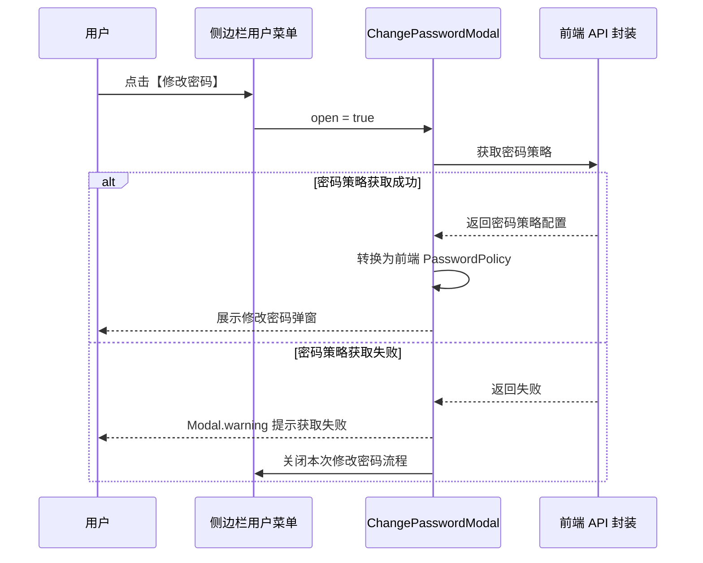

# 修改密码

## 背景

修改密码是 DIP Web 前端提供给用户的账号安全能力。用户在侧边栏用户菜单中进入修改密码流程，前端根据当前登录用户信息控制入口展示，并在展示修改密码表单前读取密码策略，用于展示策略提示和执行本地表单校验。

本文档仅描述 Web 前端实现范围和交互结果。

设计文档：[修改密码](http://confluence.aishu.cn/pages/viewpage.action?pageId=285407993)

## 目标

1. 根据当前用户账号类型控制【修改密码】入口是否展示。
2. 点击【修改密码】后先读取密码策略，读取成功后展示修改密码弹窗。
3. 密码策略读取失败时，不展示修改密码弹窗，使用 `Modal.warning` 提示用户。
4. 修改密码弹窗内完成必填、密码规则、确认密码一致性等前端校验。
5. 修改密码请求只有 HTTP 200 视为成功，其他状态停留在当前弹窗并展示错误信息。
6. 密码输入框不提供密码预览能力，也不启用自动填充。

## 实现范围

相关代码：

- `web/apps/dip/src/components/ChangePasswordModal/index.tsx`：修改密码弹窗主体，负责加载密码策略、展示表单、提交修改密码请求和展示提交错误。
- `web/apps/dip/src/components/ChangePasswordModal/utils.ts`：修改密码组件私有工具，负责密码策略转换、密码规则校验和错误码文案映射。
- `web/apps/dip/src/components/ChangePasswordModal/index.module.less`：修改密码弹窗局部样式。
- `web/apps/dip/src/utils/change-password/index.ts`：修改密码入口展示判断工具。
- `web/apps/dip/src/components/Sider/components/UserMenuItem.tsx`：侧边栏用户菜单中的修改密码入口。
- `web/apps/dip/src/apis/eacp/index.ts`：修改密码接口前端封装。
- `web/apps/dip/src/apis/dip-hub/user/index.d.ts`：用户信息类型定义，包含 `user_type`。
- `web/apps/dip/src/i18n/locales/change-password/`：修改密码功能多语言文案。

## 入口展示

修改密码入口由 `canShowChangePasswordEntry` 统一判断，当前入口位于侧边栏用户菜单。

展示规则：

| 条件                        | 是否展示【修改密码】 |
| --------------------------- | -------------------- |
| 系统内置账号 `admin`        | 展示                 |
| 系统内置账号 `security`     | 展示                 |
| 系统内置账号 `audit`        | 展示                 |
| 本地用户，`user_type === 1` | 展示                 |
| 域用户，`user_type === 2`   | 不展示               |
| 外部用户，`user_type === 3` | 不展示               |

## 打开流程

点击【修改密码】后的前端流程如下：

密码策略获取失败时，不展示修改密码表单，也不在修改密码弹窗内部展示红色错误文案。失败提示使用 `Modal.warning`，标题为修改密码标题，内容为密码策略获取失败提示。

## 弹窗交互

修改密码表单字段：

| 字段       | 说明             |
| ---------- | ---------------- |
| 账号       | 只读展示当前账号 |
| 旧密码     | 必填密码输入框   |
| 新密码     | 必填密码输入框   |
| 确认新密码 | 必填密码输入框   |

交互规则：

1. 弹窗点击右上角关闭按钮或【取消】按钮时关闭。
2. 点击遮罩空白区域不关闭弹窗。
3. 点击【确定】触发表单校验和提交。
4. 提交过程中【确定】按钮展示 loading 状态。
5. 密码输入框不展示密码预览按钮。
6. 表单和密码输入框设置 `autoComplete="off"`，不启用浏览器自动填充。
7. 弹窗样式优先使用 antd 默认样式，仅保留必要的局部样式。

按钮顺序为【确定】【取消】。

## 密码策略

前端只使用密码策略配置中的强密码开关和强密码最小长度：

| 字段              | 用途                         |
| ----------------- | ---------------------------- |
| `strongStatus`    | 是否启用强密码策略           |
| `strongPwdLength` | 强密码策略下的新密码最小长度 |

当 `strongPwdLength` 不存在或不是有效正数时，前端最小长度兜底为 6。

弱密码策略：

| 项目     | 规则                                                        |
| -------- | ----------------------------------------------------------- |
| 提示文案 | 密码为 6~100 位，可包含 英文 、 数字 、空格或半角特殊字符。 |
| 长度     | 6 到 100 位                                                 |
| 字符范围 | 半角可见字符，包含英文、数字、空格和半角特殊字符            |

强密码策略：

| 项目     | 规则                                                               |
| -------- | ------------------------------------------------------------------ |
| 提示文案 | 密码为 N~100 位，必须同时包含 大小写英文字母、数字与半角特殊字符。 |
| 长度     | N 到 100 位，N 来自 `strongPwdLength`                              |
| 字符范围 | 半角可见字符                                                       |
| 组合规则 | 必须同时包含大写英文字母、小写英文字母、数字和半角特殊字符         |

## 表单校验

点击【确定】后，前端按表单规则进行校验。

必填校验：

| 条件              | 提示文案             |
| ----------------- | -------------------- |
| 旧密码为空        | 旧密码不能为空。     |
| 旧密码超过 100 位 | 旧密码不正确         |
| 新密码为空        | 新密码不能为空。     |
| 确认新密码为空    | 确认新密码不能为空。 |

新密码校验：

| 条件                     | 提示文案               |
| ------------------------ | ---------------------- |
| 新密码与旧密码相同       | 新密码不能和旧密码相同 |
| 新密码不符合当前密码策略 | 新密码不符合规范。     |
| 确认新密码与新密码不一致 | 两次输入的密码不一致。 |

表单校验失败时，不发送修改密码请求。校验提示由 antd `Form.Item` 展示在对应输入项下方。

## 提交处理

表单校验通过后，前端提交修改密码请求。

提交前处理：

1. 使用当前账号作为 `account`。
2. 使用 RSA 公钥分别加密旧密码和新密码。
3. 对加密后的请求体生成 `sign` 参数。
4. 调用修改密码接口封装提交请求。

响应处理：

| 响应结果         | 前端行为                                       |
| ---------------- | ---------------------------------------------- |
| HTTP 200         | 提示修改成功，关闭弹窗，并延迟执行退出登录     |
| 非 HTTP 200      | 停留在修改密码弹窗，展示一行红色错误文案       |
| 请求抛出业务错误 | 停留在修改密码弹窗，根据错误码展示对应错误文案 |

修改密码请求配置了跳过 401 自动刷新和重定向逻辑。该行为仅作用于修改密码请求，不修改全局错误处理。

## 错误提示

密码策略获取失败时：

- 使用 `Modal.warning`。
- 不展示修改密码表单。
- 用户关闭 warning 后停留在原页面。

修改密码提交失败时：

- 使用弹窗内容底部的一行红色文案展示错误。
- 不使用 antd `Alert` 组件。
- 不关闭修改密码弹窗。

错误码映射：

| 错误码      | 提示文案                                         |
| ----------- | ------------------------------------------------ |
| `401001003` | 旧密码不正确                                     |
| `401001014` | 新密码不符合规范。                               |
| `401001015` | 新密码不符合规范。                               |
| `401001020` | 旧密码错误次数超过限制，账号已被锁定，请稍后重试 |
| `401001032` | 账号已被锁定，请联系管理员                       |
| `401001035` | 新密码不能为初始密码                             |

| 其他错误

## 国际化

修改密码功能文案维护在 `web/apps/dip/src/i18n/locales/change-password/` 下，包含简体中文、繁体中文和英文。

前端展示文案通过 `react-intl-universal` 获取，组件中不硬编码可见业务文案。

## 测试覆盖

当前实现包含以下前端测试覆盖：

- 修改密码入口展示判断。
- 密码策略转换和密码规则校验。
- 修改密码接口非 200 响应不进入成功逻辑。
- 侧边栏用户菜单的展示和退出登录行为。
